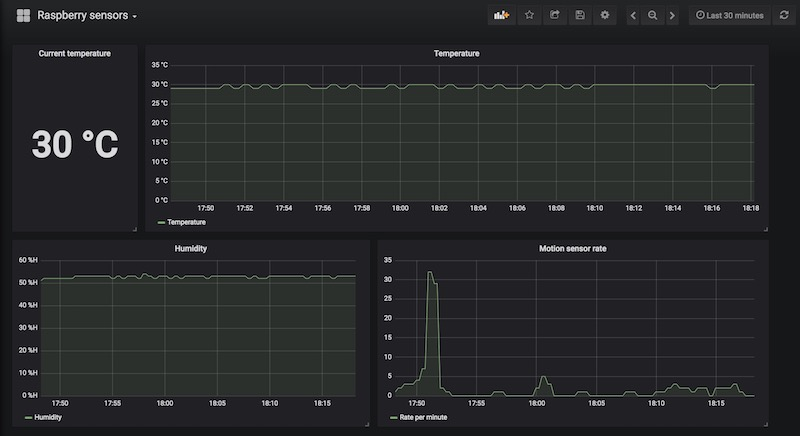
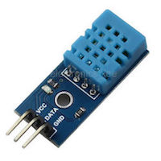
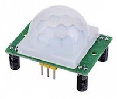
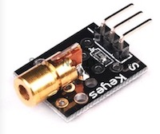

# Raspberry sensor collector service 

## Description

Java service which runs on Raspberry PI and collects data from multiple sensors using [PI4J](https://github.com/Pi4J/pi4j) library.

Includes [Ansible](https://www.ansible.com/) playbook which can deploy application on Raspberry PI and configure Grafana dashboard for sensor metrics.

Tested on Raspberry PI 2 model B.

The result looks like this:



## Author

* Bruno Hemar 

## Sensors

Following sensors are supported:

### Temperature and humidity sensor (DHT11) 
 
### Motion sensor 
 
### Laser sensor 
 

By default, application will read data from all sensors. If you don't have all sensors, disable missing ones through property file (application.yml) 

### Connecting sensors with Raspberry PI

If you are not familiar with GPIO pin numbering, check [documentation](https://www.raspberrypi.org/documentation/usage/gpio/). 
Connect sensor pins with Raspberry GPIO pins:

### DHT11 Temperature & humidity sensor

| Sensor pin |Raspberry GPIO pin|
|:----------:|:----------------:|
|    Vcc     |        5V        |
|   Ground   |      ground      |
|   Signal   |         7        |

### Laser sensor

|   Sensor pin    | Raspberry GPIO pin |
|:---------------:|:------------------:|
|   Vcc (middle)  |         5V         |
|    Ground (-)   |       ground       |
|    Signal (S)   |          2         |

### Motion sensor

| Sensor pin | Raspberry GPIO pin |
|:----------:|:------------------:|
|     Vcc    |         5V         |
|   Ground   |       ground       |
|   Signal   |         29         |

GPIO signal pins can be changed in _application.yml_ property file.

## Building the project and deploying on Raspberry PI

### Prerequisites

Building the project

* Maven 3
* Java 8 JDK 

Running the application on Raspberry PI

* Java 8 JRE installed (included in Ansible playbook)
* [wiringpi](http://wiringpi.com/download-and-install/) library installed (included in Ansible playbook)

### Build the project

```
git clone https://github.com/bhemar/raspberry-sensor-collector.git
cd sensor-collector-service
mvn clean install
```

### Deploy on Raspberry manually (without Ansible)

"Target" folder will contain executable jar "sensor-collector-service-1.0.0-SNAPSHOT.jar". Copy jar on Raspberry PI and run it:

```
cd target
scp sensor-collector-service-1.0.0-SNAPSHOT.jar pi@192.168.0.20:/tmp/
ssh pi@192.168.0.20
java -Dpi4j.debug -Dpi4j.linking=dynamic -jar /tmp/sensor-collector-service-1.0.0-SNAPSHOT.jar

```
Replace 192.168.0.20 with your Raspberry IP address. Of course, you should not use /tmp directory for jar location, this is just an example.


### Deploy on Raspberry automatically (using Ansible)

If you have Ansible installed, you can deploy application on Raspberry PI and run it with a single command.

Before running Ansible playbook, check **sensor_collector_service_jar_location** variable in:
 
 * _ansible/sensor_collector_service/roles/sensor-collector-service/defaults/main.yml_ 
 
Default is _~/IdeaProjects/sensor-collector-service/target_

Run Ansible playbook:

```
cd ansible/sensor_collector_service/
ansible-playbook raspberry.yml -i hosts -u pi -k -K --tags "sensor-collector-service"
```

Enter your Raspberry password. 


## Endpoints

The metrics are exposed in Prometheus format:

```
http://raspberry-pi:9111/actuator/prometheus
```

Control laser sensor:

```
http://raspberry-pi:9111/laser/toggle
http://raspberry-pi:9111/laser/blink
```

### Scrape metrics using Prometheus

Add job in _prometheus.yml_:

```
scrape_configs:

  - job_name: 'sensor-collector-service'
    metrics_path: '/actuator/prometheus'
    static_configs:
      - targets: ['raspberry-pi:9111']
```

### Create dashboard for sensor metrics using Ansible

Preconditions:

* Grafana 5.0 or higher
* Dashboard [provisioning]('http://docs.grafana.org/administration/provisioning/') enabled in _/etc/grafana/provisioning/dashboards/_

Run Ansible playbook with _grafana_ tag:
```
cd ansible/sensor_collector_service/
ansible-playbook raspberry.yml -i hosts -u pi -k -K --tags "grafana"
```

Find **Raspberry sensors** dashboard in Grafana.
